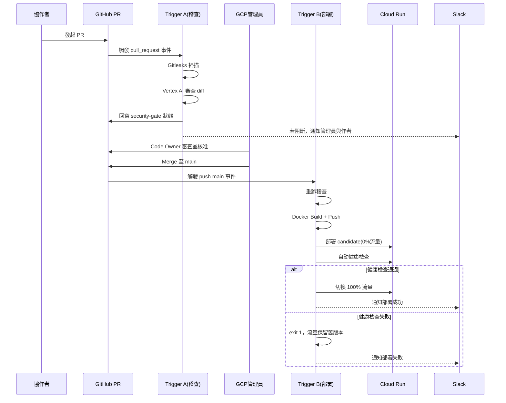

# 系統架構與技術規格文件
## GitHub 協作者自動化資安稽查與 GCP 部署系統

版本：v1.0
狀態：已與需求提出者確認 13 項架構決策，待實作

---

## 0. 文件範圍與前提

本系統解決的核心問題：外部協作者在 GitHub 上開發服務（如 Slack bot），**完全不持有任何 GCP 帳號、憑證或 Service Account Key**。GCP 管理員需要一套機制，讓協作者的程式碼在通過雙層資安稽查後，自動建置並部署到 GCP，管理員只需要做「PR 審查」與「新專案 onboarding」兩件事，不需要手動操作部署。

**架構原則**：一個協作者服務 = 一個獨立 GitHub repo = 一組專屬 GCP 身份（Cloud Build Trigger + Runtime Service Account）。所有 repo 共用同一份範本（分支保護規則、CODEOWNERS、cloudbuild.yaml 骨架），新專案上線時用 onboarding 腳本套用範本，而非每次手動設定。

---

## 1. 系統架構概觀

### 1.1 角色與元件

| 元件 | 說明 |
|---|---|
| GitHub 協作者 | 在獨立分支開發，發 PR，無任何 GCP 存取權 |
| GitHub repo（每服務一個） | main 分支受保護，套用共用範本 |
| GCP 管理員 | 唯一有權 Merge PR、唯一有 GCP 存取權限的人 |
| Cloud Build（PR 稽查 Trigger） | 監聽 PR 事件，只做「稽查」，不部署，結果回傳為 GitHub 必要狀態檢查 |
| Cloud Build（Main 部署 Trigger） | 監聽 push to main，做「稽查 + 建置 + 部署」 |
| Gitleaks | 第一層：正則比對硬編碼密鑰 |
| Vertex AI（Gemini，輕量 Flash 系列現行版本） | 第二層：針對 git diff 做語意資安審查 |
| Artifact Registry | 存放 Docker image |
| Cloud Run（每服務一個） | 實際運行服務的地方，使用專屬 Runtime Service Account |
| Secret Manager | 存放各服務的 runtime 憑證（如 Slack Token） |
| Slack（通知頻道） | 接收稽查阻擋 / 部署成功 的主動通知 |

> 設計取捨備忘：本系統**不設 staging 環境**，只有單一 prod 環境；部署安全性由「PR 稽查 gate + Cloud Run 0% 流量金絲雀部署 + 自動回滾」共同保障，而非用多環境隔離風險。

### 1.2 為什麼需要兩個 Cloud Build Trigger

原始需求文件把「PR 稽查」跟「Merge 後部署」寫在同一段敘述裡，但這其實是兩個必須分開的流程，理由如下：

- GitHub 分支保護要「PR 通過稽查才能被 Merge」，稽查結果必須在 **PR 開啟時、Merge 之前**就以 GitHub Status Check 形式出現，讓 Merge 按鈕本身被鎖住。
- 部署行為則是「Merge 之後才發生」（決策 #9：Merge 到 main 立即部署）。

因此需要：

- **Trigger A：PR 稽查**（事件：`pull_request` 開啟/更新）→ 只跑 Gitleaks + Vertex AI 審查 → 結果寫回 GitHub Status Check（`security-gate`）→ 這個 check 被設為分支保護規則裡的必要檢查項目。
- **Trigger B：Main 部署**（事件：`push` 到 `main`，即 Merge 完成後）→ 重跑一次稽查（防止 Merge Queue 造成的程式碼位移）→ 通過才建置、部署。

### 1.3 文字化循序圖

```
協作者                GitHub PR         Trigger A(稽查)      GCP 管理員      Trigger B(部署)      Cloud Run    Slack
  |                       |                    |                 |                  |               |          |
  |--開分支+開發-------->  |                    |                 |                  |               |          |
  |--發起 PR------------> |                    |                 |                  |               |          |
  |                       |--觸發 PR 事件----->  |                 |                  |               |          |
  |                       |                    |--Gitleaks 掃描--|                  |               |          |
  |                       |                    |--Vertex AI 審查-|                  |               |          |
  |                       |<--回寫 Status Check-|                 |                  |               |          |
  |                       |                    |                 |--(通知)--------------------------------->  |
  |                       |<-------------------------------------|--Code Owner 審查 |               |          |
  |                       |                                      |--核准並 Merge--> |               |          |
  |                       |                                                        |--觸發 push main|          |
  |                       |                                                        |--重跑稽查------|          |
  |                       |                                                        |--Docker Build--|          |
  |                       |                                                        |--Push Artifact-|          |
  |                       |                                                        |--Deploy(0%流量,candidate)->|
  |                       |                                                        |--自動健康檢查--------------|
  |                       |                                                        |--通過:切100%流量----------|
  |                       |                                                        |--失敗:保留舊版,exit 1------|
  |                       |                                                        |--(通知結果)-------------------------->|
```

（若採 Mermaid 檢視器，可另見附錄 A 的 `sequenceDiagram` 版本。）

---

## 2. 角色與權限矩陣（RBAC & IAM Matrix）

### 2.1 GitHub 層級權限

| 角色 | Repo 權限 | 分支保護 | CODEOWNERS |
|---|---|---|---|
| 協作者 | Write（僅限非 main 分支 + PR） | 不能直接推到 main；不能繞過必要 Status Check | 非 owner，修改受保護檔案時 PR 會標記需要管理員審查 |
| GCP 管理員 | Admin | 可 Merge；**允許繞過**必要 Status Check（決策 #6：不勾選 Include Administrators，保留緊急處理彈性，但正常流程一律走「手動 re-run」而非直接繞過） | 為 `cloudbuild.yaml`、`/security/*`、`CODEOWNERS` 本身的 Code Owner |

> 決策 #12 備忘：本系統**不**額外加 GitHub Rulesets 鎖死檔案路徑。CODEOWNERS + 必須審查已足夠，因為所有 Merge 本來就需要管理員核准。

### 2.2 GCP 服務身份權限

| 身份 | 用途 | 授予角色 | 授予範圍 |
|---|---|---|---|
| Cloud Build 預設 Trigger SA | 執行稽查、建置、部署 | `roles/aiplatform.user`（Vertex AI User）<br>`roles/run.admin`（Cloud Run Admin）<br>`roles/artifactregistry.writer` | 專案層級 |
| Cloud Build 預設 Trigger SA（額外） | 部署時需指定 Runtime SA 給 Cloud Run 使用 | `roles/iam.serviceAccountUser` | **限定在每個 Runtime SA 上**，不可專案層級全授（否則等於能冒充任何服務身份，違反最小權限） |
| 每服務專屬 Runtime SA（如 `sa-slack-bot-a@...`） | Cloud Run 執行身份，讀取自己的密鑰 | `roles/secretmanager.secretAccessor` | **限定在該服務自己的 Secret Manager 密鑰上**，不可跨服務授權 |

**不使用**：任何 Service Account JSON 金鑰下載或匯出。GitHub 端透過 Cloud Build 原生 GitHub App 連接（決策 #2），完全不需要在 GitHub Secrets 裡存放任何 GCP 憑證。

---

## 3. CI/CD 流水線詳細規格

### 3.1 Trigger A：PR 稽查（`cloudbuild-pr-check.yaml`）

| 步驟 | 動作 | 阻斷條件 |
|---|---|---|
| 1 | 計算 diff：`git diff origin/main...HEAD` | — |
| 2 | Gitleaks 掃描 diff 範圍 | **任何**比對命中 → `exit 1`（無嚴重度分級，密鑰外洩零容忍） |
| 3 | 呼叫 Vertex AI（現行輕量 Flash 模型）審查 diff（詳見第 4 節） | 回傳含 `severity: HIGH` 或 `CRITICAL` 的發現 → `exit 1`；僅 `MEDIUM`/`LOW` → 寫入 PR 留言，**不阻斷** |
| 4 | 將結果回寫為 GitHub Status Check `security-gate` | pending → success/failure |
| 5 | 發送 Slack 通知（阻擋才發，避免每個 PR 更新都洗版；也可設定「阻擋與最終通過都發」，見 3.3） | — |

此 Trigger **不執行**建置與部署，純稽查，執行速度快、成本低。

### 3.2 Trigger B：Main 部署（`cloudbuild-deploy.yaml`）

```yaml
steps:
  # 1. 重跑稽查（防止 Merge Queue 期間程式碼位移）
  - id: gitleaks-scan
    ...  # 同 3.1 步驟 2，命中即 exit 1

  - id: vertex-ai-review
    ...  # 同 3.1 步驟 3，High/Critical 即 exit 1

  # 2. 建置與推送
  - id: docker-build
    name: gcr.io/cloud-builders/docker
    args: ['build', '-t', '${_IMAGE}', '.']

  - id: push-artifact-registry
    name: gcr.io/cloud-builders/docker
    args: ['push', '${_IMAGE}']

  # 3. 金絲雀部署：先 0% 流量
  - id: deploy-candidate
    name: gcr.io/google.com/cloudsdktool/cloud-sdk
    entrypoint: gcloud
    args:
      - run
      - deploy
      - ${_SERVICE_NAME}
      - --image=${_IMAGE}
      - --service-account=${_RUNTIME_SA}
      - --no-traffic
      - --tag=candidate
      - --region=${_REGION}

  # 4. 自動健康檢查
  - id: health-check
    name: gcr.io/cloud-builders/curl
    args: ['-f', 'https://candidate---${_SERVICE_NAME}-xxxxx.${_REGION}.run.app/healthz']
    # 失敗 → exit 非 0 → 後續步驟不執行，流量保留在舊版本，等同自動回滾

  # 5. 健康檢查通過才切流量
  - id: promote-traffic
    name: gcr.io/google.com/cloudsdktool/cloud-sdk
    entrypoint: gcloud
    args: ['run', 'services', 'update-traffic', '${_SERVICE_NAME}', '--to-latest', '--region=${_REGION}']

  # 6. Slack 通知（成功/失敗都發，決策 #7）
  - id: notify-slack
    ...
```

**自動回滾邏輯（決策 #4）**：新版本一律先以 `--no-traffic` 部署成獨立可存取的 `candidate` 修訂版本，通過健康檢查後才切換 100% 流量。因此「回滾」實際上是「從未真正上線」，比事後回滾更安全——正式流量永遠只會導向已驗證過的版本。

### 3.3 誤判處理流程（決策 #3）

若 Gitleaks 或 Vertex AI 判定為誤判：

1. 管理員在 PR 或 Slack 通知中確認是誤判
2. 管理員到 Cloud Build 控制台，對該次失敗的 Build **手動點擊 Retry**
3. 不提供任何程式碼內建的白名單/註解豁免機制，避免協作者自行繞過掃描

### 3.4 通知規則（決策 #7）

| 事件 | 通知對象 | 內容 |
|---|---|---|
| PR 稽查被阻斷 | 管理員 + 該 PR 作者 | 哪一層擋下、命中規則摘要（不含完整密鑰內容） |
| Main 部署失敗（含健康檢查失敗） | 管理員 | 失敗步驟、Cloud Build Log 連結 |
| Main 部署成功 | 管理員 + 該服務作者 | 部署版本、Cloud Run URL |

---

## 4. Vertex AI 審查邏輯與 Prompt 設計規範

### 4.1 模型指定（決策 #5）

規格層級**不鎖死模型版本號**，一律指定為「GCP Vertex AI 現行最新輕量快速 Gemini Flash 模型」。實際 model id 與 AI 端點分別寫在 `cloudbuild.yaml` 的 substitution 變數 `_AI_MODEL` 與 `_AI_LOCATION` 中，onboarding 或例行維護時可直接更新，不需改動審查邏輯。AI 端點與 Cloud Run 部署區域互相獨立。

```yaml
substitutions:
  _AI_MODEL: 'gemini-3.1-flash-lite' # 試點當下使用值，必須隨模型生命週期更新
  _AI_LOCATION: 'global'             # 依模型可用區域設定
```

### 4.2 輸入格式

僅傳入**增量 diff**（`git diff <merge-base>...<HEAD>`），不傳整個專案，符合 NFR 的成本與延遲控制要求。
由於 Trigger 預設是 shallow checkout，PR gate 使用每個 repo 獨立的唯讀
GitHub Deploy Key 取得 base/head 歷史。私鑰只存於 Secret Manager，
且僅 PR Build Service Account 擁有該 secret 的 accessor 權限。

```json
{
  "repo": "slack-bot-a",
  "pr_number": 42,
  "diff": "<unified diff text>",
  "changed_files": ["src/handler.py", "src/utils.py"]
}
```

### 4.3 判定標準

重點檢查項目（沿用原始需求）：SQL Injection、Command Injection、SSRF、邏輯漏洞、非典型金鑰外流模式（Gitleaks 正則比對不到的、經過變形或組字串產生的憑證）。

**嚴重度分級（決策 #8）**：

| 嚴重度 | 定義 | 阻斷行為 |
|---|---|---|
| CRITICAL | 可直接遠端利用（如未過濾的 SQL 拼接、任意命令執行） | 阻斷 |
| HIGH | 明確漏洞但利用條件較高，或高度疑似的憑證外洩 | 阻斷 |
| MEDIUM | 潛在風險但需特定條件觸發 | 不阻斷，寫入 PR 留言 |
| LOW | 程式碼風格/最佳實踐建議 | 不阻斷，寫入 PR 留言 |

### 4.4 JSON 回傳 Schema

要求 Gemini 以下列 JSON Schema 回傳，禁止自由格式文字回覆：

```json
{
  "type": "object",
  "required": ["pass", "findings"],
  "properties": {
    "pass": { "type": "boolean", "description": "true 表示無 HIGH/CRITICAL 發現" },
    "findings": {
      "type": "array",
      "items": {
        "type": "object",
        "required": ["severity", "category", "file", "line", "summary"],
        "properties": {
          "severity": { "enum": ["CRITICAL", "HIGH", "MEDIUM", "LOW"] },
          "category": { "type": "string", "description": "如 sqli, command-injection, ssrf, hardcoded-secret, logic-flaw" },
          "file": { "type": "string" },
          "line": { "type": "integer" },
          "summary": { "type": "string" }
        }
      }
    }
  }
}
```

Cloud Build 稽查腳本解析此 JSON：只要 `findings` 中存在任一 `severity` 為 `CRITICAL` 或 `HIGH`，即視為 `pass=false`，`exit 1`。

### 4.5 Prompt 設計要點

- System Prompt 需明確要求「只分析提供的 diff 增量，不要評論未變更的程式碼」
- 需明確要求「嚴格按照上述 JSON Schema 回傳，不要有 Schema 以外的文字」
- 需提供 few-shot 範例（一個 CRITICAL 案例、一個 LOW 案例），穩定模型的嚴重度判斷尺度

---

## 5. 目錄結構與關鍵檔案說明

### 5.1 每個協作者 repo 內的結構

```
repo-root/
├── CODEOWNERS                      # 鎖定下列檔案需管理員審查（決策 #12：不額外加 Rulesets）
├── cloudbuild-pr-check.yaml        # Trigger A：PR 稽查專用
├── cloudbuild-deploy.yaml          # Trigger B：main 部署專用
├── Dockerfile
├── src/                            # 協作者自由開發區域，不受 CODEOWNERS 限制
└── .security/
    └── vertex-ai-prompt.md         # Vertex AI 審查用的 system prompt 範本（受 CODEOWNERS 保護）
```

`CODEOWNERS` 內容範例：

```
/cloudbuild-pr-check.yaml   @gcp-admin
/cloudbuild-deploy.yaml     @gcp-admin
/.security/                 @gcp-admin
/CODEOWNERS                 @gcp-admin
```

### 5.2 管理端共用範本 repo（供 onboarding 腳本取用）

```
deploy-templates/
├── templates/
│   ├── cloudbuild-pr-check.yaml.tmpl
│   ├── cloudbuild-deploy.yaml.tmpl
│   └── CODEOWNERS.tmpl
└── scripts/
    └── onboard-new-repo.sh         # 決策 #13：新專案 onboarding 一次性腳本
```

---

## 6. 建置與驗證步驟（Setup & Verification）

### 6.1 專案層級一次性設定（整個 GCP 專案只做一次）

1. 啟用 API：`run.googleapis.com`、`artifactregistry.googleapis.com`、`aiplatform.googleapis.com`、`secretmanager.googleapis.com`、`cloudbuild.googleapis.com`
2. 在 GCP 控制台安裝 Cloud Build GitHub App，取得組織/帳號層級授權（決策 #2，無需任何 Webhook Secret 或 PAT）

### 6.2 新專案 Onboarding 腳本（決策 #13，每個新 repo 跑一次）

```bash
#!/usr/bin/env bash
# onboard-new-repo.sh
# 用法: ./onboard-new-repo.sh <repo-name> <region>
set -euo pipefail
REPO_NAME="$1"
REGION="${2:-asia-east1}"
SA_NAME="sa-${REPO_NAME}"
SA_EMAIL="${SA_NAME}@${PROJECT_ID}.iam.gserviceaccount.com"

# 1. 建立專屬 Runtime Service Account（決策 #10：每服務一個，先建立不需等服務存在）
gcloud iam service-accounts create "${SA_NAME}" \
  --display-name="Runtime SA for ${REPO_NAME}"

# 2. 建立 PR 稽查 Trigger
gcloud builds triggers create github \
  --name="${REPO_NAME}-pr-check" \
  --repo-name="${REPO_NAME}" --repo-owner="${GITHUB_ORG}" \
  --pull-request-pattern="^main$" \
  --build-config="cloudbuild-pr-check.yaml"

# 3. 建立 Main 部署 Trigger
gcloud builds triggers create github \
  --name="${REPO_NAME}-deploy" \
  --repo-name="${REPO_NAME}" --repo-owner="${GITHUB_ORG}" \
  --branch-pattern="^main$" \
  --build-config="cloudbuild-deploy.yaml" \
  --substitutions="_RUNTIME_SA=${SA_EMAIL},_SERVICE_NAME=${REPO_NAME},_REGION=${REGION},_AI_MODEL=${AI_MODEL},_AI_LOCATION=${AI_LOCATION}"

# 4. 授予 Cloud Build SA 使用該 Runtime SA 的權限（限定範圍，非專案層級）
gcloud iam service-accounts add-iam-policy-binding "${SA_EMAIL}" \
  --member="serviceAccount:${CLOUDBUILD_SA}" \
  --role="roles/iam.serviceAccountUser"

echo "Onboarding 完成。若此服務需要密鑰，請另跑 add-secret.sh <secret-name>"
```

搭配的 `add-secret.sh`（依決策 #10 / #11 流程）：

```bash
#!/usr/bin/env bash
# add-secret.sh <repo-name> <secret-name>
# 前置：協作者已透過一次性連結（如 onetimesecret.com）將真實值傳給管理員（決策 #11）
set -euo pipefail
REPO_NAME="$1"; SECRET_NAME="$2"
SA_EMAIL="sa-${REPO_NAME}@${PROJECT_ID}.iam.gserviceaccount.com"

read -rsp "貼上從一次性連結取得的真實值（螢幕不回顯）: " SECRET_VALUE
echo
printf '%s' "$SECRET_VALUE" | gcloud secrets create "${SECRET_NAME}" --data-file=- 2>/dev/null \
  || printf '%s' "$SECRET_VALUE" | gcloud secrets versions add "${SECRET_NAME}" --data-file=-
unset SECRET_VALUE

gcloud secrets add-iam-policy-binding "${SECRET_NAME}" \
  --member="serviceAccount:${SA_EMAIL}" \
  --role="roles/secretmanager.secretAccessor"

echo "完成。請告知協作者密鑰名稱：${SECRET_NAME}（不含真實值）"
```

### 6.3 新協作者上線檢查清單

- [ ] 協作者提出新 repo 需求，填寫「服務資源需求問卷」（需要哪些密鑰、是否存取其他 GCP 資源）
- [ ] 管理員在 GitHub 建立 repo，套用範本（`CODEOWNERS`、`cloudbuild-*.yaml`）
- [ ] 設定分支保護：required status check = `security-gate`，Code Owner review 必須，**不勾選 Include administrators**（決策 #6）
- [ ] 執行 `onboard-new-repo.sh`
- [ ] 若需密鑰，走一次性連結交付流程 + 執行 `add-secret.sh`
- [ ] 協作者發第一個測試 PR，驗證 `security-gate` 狀態檢查正確出現並可正確通過/阻斷
- [ ] 確認 Merge 後 Trigger B 正確建置、部署，Slack 收到通知
- [ ] 驗證 Cloud Run 服務只能被自己的 Runtime SA 存取到自己的密鑰（用另一個服務的身份嘗試讀取，應被拒絕）

### 6.4 驗證項目對照表

| 驗證項目 | 對應決策 | 驗證方式 |
|---|---|---|
| 協作者無法繞過稽查直接 Merge | #6 | 用協作者帳號嘗試 Merge 未通過稽查的 PR，應被 GitHub 阻擋 |
| Gitleaks 誤判可恢復 | #3 | 故意讓 Gitleaks 誤判，確認管理員可在 Cloud Build 控制台 Retry |
| Medium/Low 不阻斷 | #8 | 提交一個風格建議等級的 diff，確認 PR 通過但留言可見 |
| 部署失敗不影響現有流量 | #4 | 故意讓 health check 失敗，確認 Cloud Run 正式流量仍在舊版本 |
| 跨服務密鑰隔離 | #10 | 見 6.3 最後一項 |

---

## 附錄 A：Mermaid 版循序圖



---

## 附錄 B：已確認架構決策總覽

| # | 項目 | 結論 |
|---|---|---|
| 1 | Repo 架構 | 多個獨立 repo，共用範本 |
| 2 | 觸發機制 | Cloud Build 原生 GitHub App Trigger |
| 3 | 誤判處理 | 管理員手動 Retry |
| 4 | 環境策略 | 單一 prod + Cloud Run 金絲雀部署/自動回滾 |
| 5 | AI 模型 | 現行最新輕量 Gemini Flash，不鎖版本 |
| 6 | 管理員繞過 | 允許（保留緊急彈性） |
| 7 | 通知機制 | Slack，阻擋/成功都發 |
| 8 | 阻斷閾值 | 分嚴重度，僅 High/Critical 阻斷 |
| 9 | 部署時機 | Merge 到 main 立即部署 |
| 10 | 密鑰管理 | 每服務專屬 SA + Secret Manager |
| 11 | 密鑰交付 | v1 一次性連結工具 |
| 12 | 設定檔保護 | CODEOWNERS + 必須審查 |
| 13 | Onboarding | gcloud CLI 腳本 |
